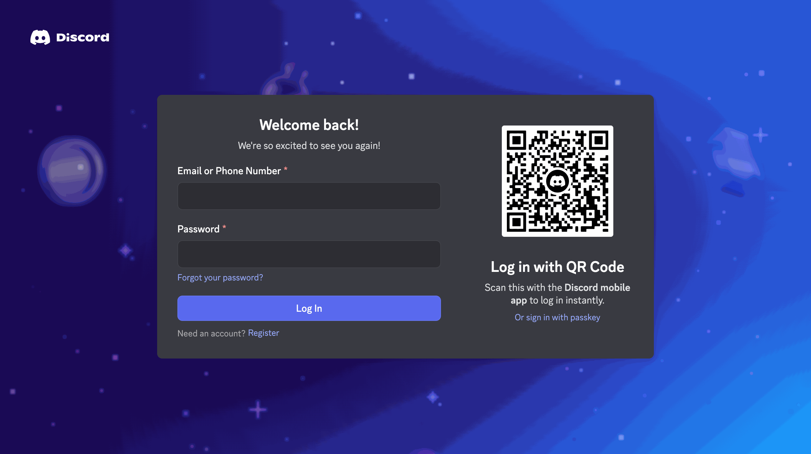

# Discord Login Page Clone

## Side-by-Side Comparison

  <table>
    <tr>
      <td align="center">
        <strong>Clone</strong> 
        
      </td>
      <td align="center">
        <strong>Original Discord Login</strong> 
        
      </td>
    </tr>
  </table>

## Author

**M. Waleed Ishaq**

- GitHub: [@wldex](https://github.com/B1ackEx)

## Acknowledgements

- Inspired by [Discord's Login Page](https://discord.com/login)
- [qrcode-generator](https://www.npmjs.com/package/qrcode-generator) for QR code generation
- Discord's design team for the beautiful UI

### Important Disclaimer

This project is **NOT affiliated with, endorsed by, or connected to Discord Inc.** in any way.

It is a **frontend clone created purely for educational and non-commercial purposes** to demonstrate web development skills.

Using this project for illegal purposes is **unethical and illegal**.

---

**If you found this project helpful, please consider giving it a star!**

Made by [wldex](https://github.com/B1ackEx)

